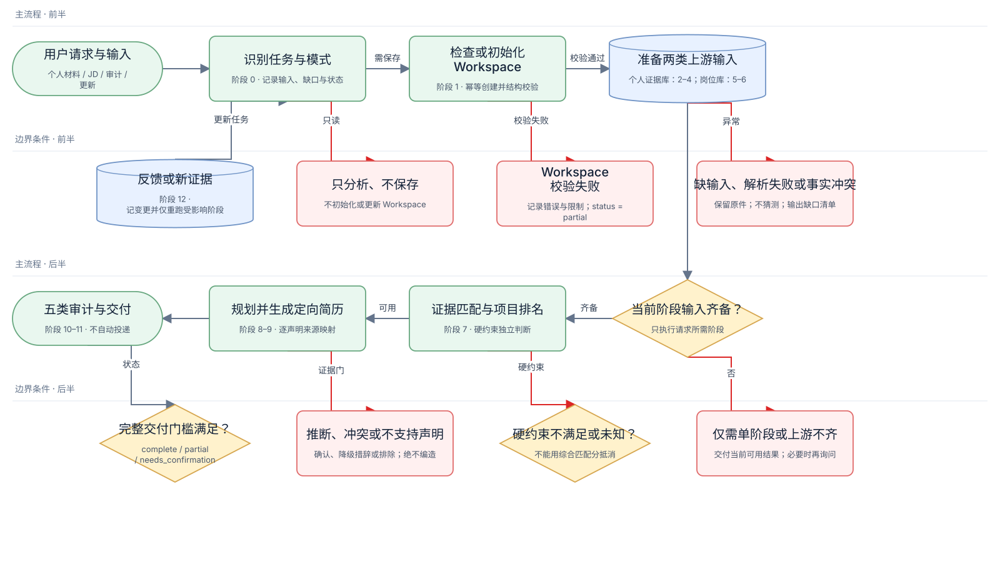

# Resume Tailor

一个面向定向求职的 Codex Skill。它会先把简历、作品集、项目材料和工作经历整理成可追溯的证据库，再结合目标岗位 JD 完成岗位分析、经历匹配、简历改写、事实审计和面试问题预测。

这个项目的重点不是“堆关键词”，而是确保最终简历中的主要声明都能回到真实材料，并明确区分：

- 个人贡献与团队成果；
- 已发生的结果与目标指标；
- 已核实事实、用户确认信息和待确认推断；
- 强证据、弱证据与相互冲突的材料。

> Resume Tailor 不会虚构经历、数字、职责或成果，也不会自动投递职位或发送简历。



## 能做什么

- 导入并拆解 PDF、DOCX、Markdown、文本、图片等个人材料；
- 建立候选人资料、工作/实习/研究经历和项目证据库；
- 检查项目是否具备可用的 STAR 信息与来源证据；
- 分析目标岗位的职责、硬性条件、能力要求和 ATS 关键词；
- 按 JD 相关性、证据强度、个人主导程度、结果影响等维度匹配经历；
- 选择最相关的项目，生成一页或指定篇幅的定向简历；
- 生成逐条声明的来源映射、事实审计、缺失信息清单和面试追问；
- 接收新材料或用户反馈，并只重新运行受影响的阶段。

## 环境要求

- 支持 Skills 的 Codex 环境；
- Python 3.10 或更高版本；
- Node.js 仅在重新导出工作流 SVG 时需要，普通使用不需要；
- 本 Skill 的本地脚本无需单独配置 OpenAI API Key，也没有需要安装的 Python 第三方依赖。

## 安装

仓库中的 Skill 位于 `resume-tailor/`。安装后的目录应满足：

```text
~/.codex/skills/resume-tailor/
├── SKILL.md
├── agents/
├── assets/
├── references/
└── scripts/
```

将仓库克隆到本地后，把完整的 `resume-tailor` 目录复制到 Codex Skills 目录：

```bash
git clone <repository-url>
cd Resume_Skill
mkdir -p ~/.codex/skills
cp -R ./resume-tailor ~/.codex/skills/resume-tailor
```

如果已经存在同名目录，请先确认其中是否有需要保留的个人修改，再决定是更新现有版本还是使用新的目录名。安装后重新打开 Codex 或新建一个任务，并确认可用 Skills 中出现 `resume-tailor`。

本地开发时也可以使用符号链接，让修改立即生效：

```bash
mkdir -p ~/.codex/skills
ln -s /absolute/path/to/Resume_Skill/resume-tailor ~/.codex/skills/resume-tailor
```

创建链接前，目标路径 `~/.codex/skills/resume-tailor` 应当不存在。

## 快速开始

### 1. 准备个人材料

建议先准备以下内容，材料不完整也可以开始：

- 当前简历；
- 项目或作品集说明；
- 实习、工作、研究或课程项目材料；
- 能证明结果的数据、报告、截图或复盘；
- 目标岗位 JD，可使用文本、文件、截图或链接。

不需要手工整理成固定模板。原始材料越具体，最终简历的可用证据越强。

### 2. 打开求职任务目录

在 Codex 中打开一个用于本次求职的目录，例如：

```text
my-job-search/
```

Skill 会把该目录下的 `workspace/` 作为个人资料和生成结果的事实来源。请不要把真实个人材料放进本 Skill 的安装目录。

### 3. 上传材料并调用 Skill

上传个人材料后，在对话中输入：

```text
$resume-tailor 自动导入并拆解我刚上传的个人材料，建立可追溯的经历库。
不确定的信息标为待确认，不要编造。
```

未指定其他阶段时，上传个人材料并调用 `$resume-tailor` 会默认执行 `ingest`：

1. 创建或补齐 `workspace/`；
2. 登记并解析本次材料；
3. 拆解候选人资料、项目和经历；
4. 生成完整性报告和少量高优先级待确认问题。

初始化和更新都是幂等的：已有文件会被保留，原始材料不会被覆盖或删除。

### 4. 提供目标岗位并生成定向简历

完成材料导入后，上传或粘贴 JD，并输入：

```text
$resume-tailor 根据这个 JD 分析岗位要求，匹配我已有的经历，选择最相关项目，
生成一页中文定向简历，并完成事实审计和面试问题预测。
```

如需英文版、两页版或指定输出格式，可以直接说明：

```text
$resume-tailor 针对这个 JD 生成一页英文简历，同时保留 Markdown 内容源，
并输出 DOCX。所有数字和成果必须有来源。
```

生成 DOCX 或 PDF 时，Codex 会调用相应文档能力进行排版和渲染检查；本 Skill 自身负责内容、证据和审计逻辑。

### 5. 回答待确认问题并更新

如果 Skill 发现会影响真实性或项目选择的关键信息缺口，会提出少量具体问题。可以直接回答，也可以回答“没有”“不记得”或“无法确认”。例如：

```text
$resume-tailor 更新：该测试共有 8 名参与者；需求由我提出，最终上线由团队负责。
请更新证据状态，并重新生成受影响的简历内容。
```

系统会保留来源和变更记录，不会把无法确认的信息强行写成事实。

## 常用调用示例

| 目标 | 示例提示词 |
|---|---|
| 初始化工作区 | `$resume-tailor 初始化当前任务的 workspace，并校验目录结构。` |
| 导入个人材料 | `$resume-tailor 导入我刚上传的简历和作品集，拆解项目与经历。` |
| 检查证据缺口 | `$resume-tailor 检查所有项目的 STAR 和证据完整性，只问最关键的问题。` |
| 只分析 JD | `$resume-tailor 只分析这个 JD，不生成简历。` |
| 匹配岗位 | `$resume-tailor 把这个 JD 与我的经历库匹配，列出项目排名、硬性条件和未覆盖要求。` |
| 生成定向简历 | `$resume-tailor 根据这个 JD 生成一页中文简历，并保留逐条来源映射。` |
| 审计现有简历 | `$resume-tailor 审计这份简历的事实、相关性、重复、篇幅和追问风险。` |
| 更新经历库 | `$resume-tailor 用我刚补充的数据更新项目记录，并重新运行受影响阶段。` |
| 完整流程 | `$resume-tailor 使用已有材料完成岗位分析、匹配、生成和审计。` |
| 只分析不保存 | `$resume-tailor 只分析这份材料，不创建或更新 workspace。` |

Skill 支持以下运行阶段：

| 阶段 | 作用 |
|---|---|
| `initialize` | 创建 Workspace |
| `ingest` | 登记、解析并规范化个人材料 |
| `validate` | 检查项目、STAR 和证据完整性 |
| `analyze-job` | 登记并分析目标岗位 |
| `match` | 匹配岗位要求与个人证据 |
| `generate` | 规划并生成定向简历 |
| `audit` | 审查事实、相关性、重复性、篇幅和风险 |
| `update` | 用新材料、补充信息或反馈更新经历库 |
| `full-run` | 从已有材料运行完整流程 |

通常不需要在提示词中写阶段名，只要清楚描述想要的结果即可。

## Workspace 与输出文件

运行后会在当前求职任务中创建：

```text
workspace/
├── inbox/                         # 尚未处理的原始材料
├── sources/                       # 来源目录、提取文本和导入报告
├── profile/                       # 基础信息、教育、技能、奖项和待确认问题
├── experiences/                   # 工作、实习和研究经历；一项一个 JSON
├── projects/                      # 项目记录；一个项目一个 JSON
├── jobs/<job-id>/                 # JD 原文、岗位分析、证据矩阵和简历计划
├── outputs/<job-id>/              # 最终简历与审计结果
└── state/                         # 运行状态、变更日志、模板和 staging 数据
```

一次完整运行通常会生成：

```text
workspace/jobs/<job-id>/
├── jd-original.md
├── jd-analysis.json
├── jd-analysis-summary.md
├── evidence-matrix.json
└── resume-plan.json

workspace/outputs/<job-id>/
├── resume.md
├── resume-source-map.json
├── resume-review.md
├── missing-information.md
└── interview-questions.md
```

其中：

- `resume.md`：定向简历的可审计内容源；
- `resume-source-map.json`：每条主要简历声明对应的经历字段和来源；
- `resume-review.md`：事实、相关性、重复性、篇幅和风险审计；
- `missing-information.md`：申请前必须确认、建议补充和允许缺失的信息；
- `interview-questions.md`：围绕简历声明、岗位能力和弱证据生成的追问；
- `evidence-matrix.json`：岗位要求、匹配记录、分项评分、风险和推荐用途。

## 证据状态

Skill 使用以下状态控制信息能否进入最终简历：

| 状态 | 含义 | 可直接用于最终简历 |
|---|---|---|
| `verified` | 原始材料明确记载 | 是 |
| `user_confirmed` | 用户明确确认 | 是 |
| `inferred` | 可以合理推断，但尚未确认 | 否 |
| `conflicting` | 不同来源存在冲突 | 否 |
| `missing` | 缺少信息 | 否 |
| `missing_confirmed` | 用户确认没有、不记得或无法确认 | 否，但不会重复追问 |
| `unsupported` | 没有证据或证据否定该表述 | 否 |

没有量化结果并不等于无法生成简历。Skill 会降低措辞强度，并优先使用真实的行动、决策、交付物、测试发现或定性反馈。

## 开发者使用

以下脚本用于确定性初始化、校验和岗位匹配写入。普通用户通常无需手工运行。

### 初始化 Workspace

```bash
python3 resume-tailor/scripts/init_workspace.py --root ./workspace
```

脚本只创建缺失的目录、模板和空白文件，不覆盖已有内容。

### 校验 Workspace

```bash
python3 resume-tailor/scripts/validate_workspace.py --root ./workspace
```

校验内容包括目录结构、JSON 契约、稳定 ID、证据状态、项目/经历引用、岗位文件和来源映射。

### 准备紧凑匹配上下文

先读取全部记录的证据卡：

```bash
python3 resume-tailor/scripts/prepare_match_context.py \
  --root ./workspace \
  --pretty
```

再只展开候选记录：

```bash
python3 resume-tailor/scripts/prepare_match_context.py \
  --root ./workspace \
  --record project:sample-project \
  --record experience:sample-experience \
  --pretty
```

### 应用岗位匹配 Bundle

岗位分析和证据匹配使用 staging bundle，避免直接修改已有 Workspace JSON。完整契约见 [`job-match-workflow.md`](resume-tailor/references/job-match-workflow.md)。基本流程为：

```bash
python3 resume-tailor/scripts/apply_match_bundle.py start \
  --root ./workspace \
  --job-id sample-role \
  --mode match \
  --task "Match sample role"

python3 resume-tailor/scripts/apply_match_bundle.py apply \
  --root ./workspace \
  --bundle-dir ./workspace/state/staging/<bundle-id> \
  --dry-run

python3 resume-tailor/scripts/apply_match_bundle.py apply \
  --root ./workspace \
  --bundle-dir ./workspace/state/staging/<bundle-id> \
  --consume

python3 resume-tailor/scripts/validate_workspace.py --root ./workspace
```

应用脚本会校验 bundle、按固定权重计算匹配分、幂等更新来源目录、追加变更日志，并在全部内容有效后原子替换目标文件。

### 运行测试

```bash
python3 -m unittest discover -s resume-tailor/tests -v
```

测试不依赖网络，会在临时目录中验证上下文压缩、bundle 校验、确定性评分、幂等写入和错误状态拦截。

## 项目结构

```text
resume-tailor/
├── SKILL.md                        # Skill 入口、触发条件和核心约束
├── agents/openai.yaml              # Codex 中的展示名称和默认提示词
├── assets/templates/               # Workspace JSON 模板
├── references/
│   ├── workflow.md                 # 分阶段工作流
│   ├── workspace-schema.md         # Workspace 文件契约
│   ├── job-match-workflow.md       # JD 分析与证据匹配流程
│   └── scoring-writing-audit.md    # 评分、写作和审计规则
├── scripts/                        # 初始化、校验和匹配写入脚本
├── tests/                          # 工作流单元测试
└── docs/workflow-diagrams/         # Mermaid 源文件和 SVG 流程图
```

## 常见问题

### Codex 中看不到 `$resume-tailor`

检查安装路径是否为 `~/.codex/skills/resume-tailor/SKILL.md`，而不是多嵌套了一层目录；然后重新打开 Codex 或新建任务。

### 只有 JD，没有个人材料，可以生成吗？

可以先执行岗位分析，但不能进行可信的经历匹配或定向简历生成。请至少提供当前简历、项目说明或工作经历材料之一。

### 材料之间的数字或职责描述冲突怎么办？

Skill 会同时保留来源并标记为 `conflicting`。用户确认前，争议信息不会进入最终简历。

### 没有业务数据或量化结果怎么办？

可以继续。简历会使用有证据的过程、交付物、测试结果、决策影响或定性反馈，不会为了“看起来更强”而编造数字。

### 能否直接编辑 Workspace JSON？

可以，但必须遵守 [`workspace-schema.md`](resume-tailor/references/workspace-schema.md) 的契约。修改后应立即运行 `validate_workspace.py`。岗位匹配相关的已有 JSON 建议通过 staging bundle 和 `apply_match_bundle.py` 更新。

### 会覆盖原始材料吗？

不会。初始化脚本只创建缺失内容，Skill 要求保留原件、来源关系和变更记录，也不会自动删除文件。

### 会自动投递岗位吗？

不会。本项目只负责材料管理、岗位匹配、简历生成和审计，不会发送简历或自动投递。

## 设计原则

1. 真实性优先于关键词密度；
2. 证据可追溯优先于措辞强度；
3. 个人职责边界优先于团队成果包装；
4. 缺少数据时继续产出可支持的版本，而不是补造数字；
5. 先删除弱相关内容，再压缩文字，不用极小字号解决一页限制；
6. 每个岗位的定向措辞只影响该岗位输出，不反向修改基础事实。
